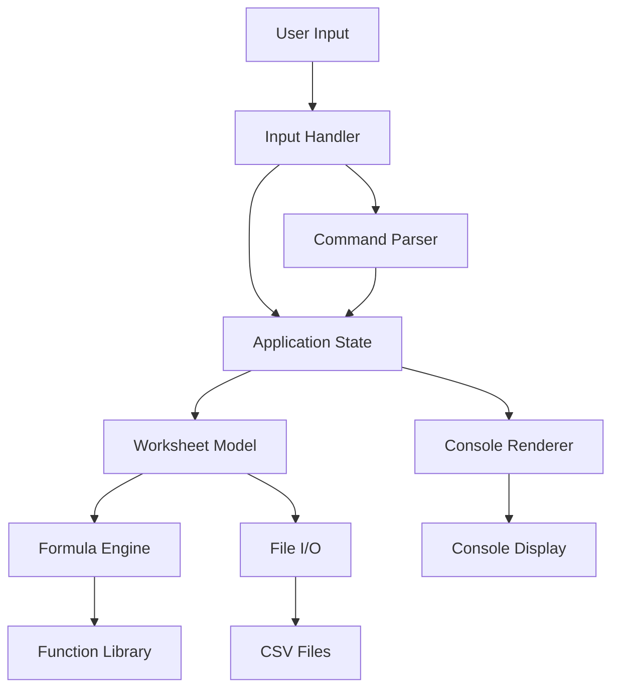
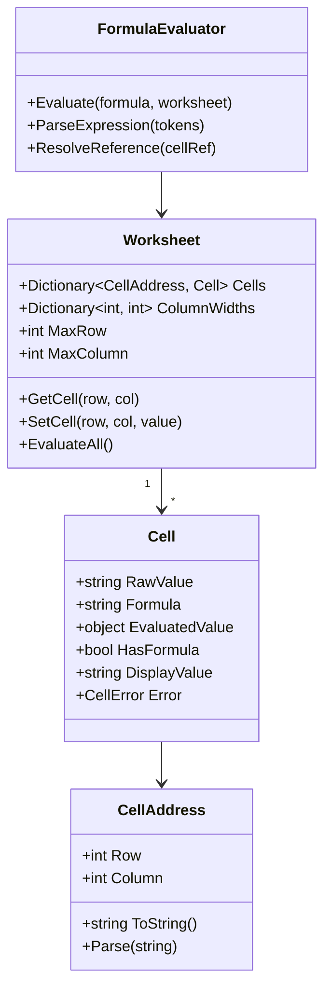
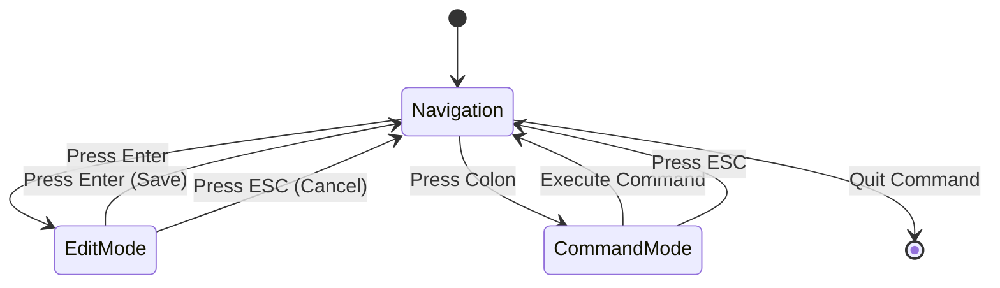
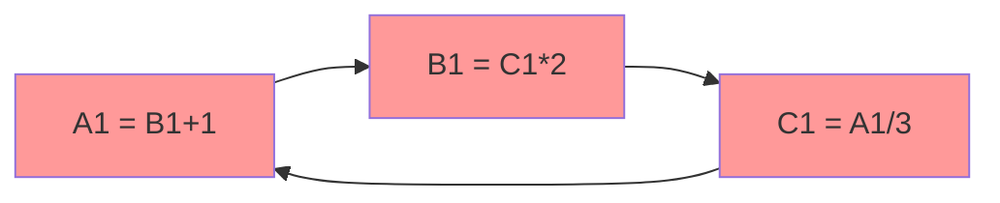

# CSS Architecture & Implementation Guide

## System Architecture

### High-Level Component Diagram



### Data Model Structure



### Application State Flow



## Key Implementation Details

### 1. Cell Reference System

**Column Naming (A-ZZ):**
- A = 0, B = 1, ..., Z = 25
- AA = 26, AB = 27, ..., AZ = 51
- BA = 52, ..., ZZ = 701

**Conversion Algorithm:**
```csharp
// Column name to index
int ColumnToIndex(string col)
{
    int result = 0;
    for (int i = 0; i < col.Length; i++)
    {
        result = result * 26 + (col[i] - 'A' + 1);
    }
    return result - 1;
}

// Index to column name
string IndexToColumn(int index)
{
    string result = "";
    index++;
    while (index > 0)
    {
        int remainder = (index - 1) % 26;
        result = (char)('A' + remainder) + result;
        index = (index - 1) / 26;
    }
    return result;
}
```

### 2. Formula Parsing Strategy

**Tokenization:**
```
Input: =A1+B2*3
Tokens: [=, A1, +, B2, *, 3]
```

**Abstract Syntax Tree (AST):**
```
        +
       / \
      A1  *
         / \
        B2  3
```

**Evaluation Order:**
1. Parse formula into tokens
2. Build AST respecting operator precedence
3. Evaluate AST recursively
4. Resolve cell references during evaluation

### 3. Function Implementation

**Range Parsing:**
```
A1:B10 → List of cells from A1, A2, ..., A10, B1, B2, ..., B10
```

**Function Signatures:**
```csharp
double SUM(List<Cell> range)
double AVERAGE(List<Cell> range)
double MIN(List<Cell> range)
double MAX(List<Cell> range)
object IF(bool condition, object trueValue, object falseValue)
```

### 4. Console Rendering

**Viewport Calculation:**
```
Terminal Size: 120 columns × 30 rows
Header Row: 1 row
Status Bar: 1 row
Available Data Rows: 28 rows

Visible Columns: Depends on column widths
- Row number column: 5 chars
- Data columns: Fit as many as possible
```

**Rendering Algorithm:**
```
1. Calculate visible cell range based on scroll position
2. Render header row (column names)
3. For each visible row:
   - Render row number
   - Render visible cells
   - Highlight active cell
4. Render status bar
```

### 5. Dependency Tracking

**Circular Reference Detection:**


**Algorithm:**
- Use depth-first search during evaluation
- Track visited cells in current evaluation path
- If cell is revisited, circular reference detected

### 6. File Format

**CSV Structure:**
```csv
100,200,=A1+B1
=A1*2,=B1*2,=C1*2
Text,=SUM(A1:B2),=AVERAGE(A1:B2)
```

**Parsing Rules:**
- Values starting with `=` are formulas
- Numeric values are stored as numbers
- Everything else is text
- Empty cells are represented by empty fields

## Implementation Checklist

### Core Components

- [ ] **CellAddress.cs**: Parse and format cell references
- [ ] **Cell.cs**: Store value, formula, and evaluated result
- [ ] **Worksheet.cs**: Manage grid of cells
- [ ] **ColumnInfo.cs**: Store column width settings

### Formula Engine

- [ ] **Tokenizer.cs**: Split formula into tokens
- [ ] **Parser.cs**: Build AST from tokens
- [ ] **Evaluator.cs**: Evaluate AST
- [ ] **FunctionLibrary.cs**: Implement spreadsheet functions
- [ ] **DependencyTracker.cs**: Detect circular references

### User Interface

- [ ] **ConsoleRenderer.cs**: Draw grid to console
- [ ] **Viewport.cs**: Manage visible area and scrolling
- [ ] **InputHandler.cs**: Process keyboard input
- [ ] **StatusBar.cs**: Display current state

### File Operations

- [ ] **CsvReader.cs**: Load CSV files
- [ ] **CsvWriter.cs**: Save CSV files
- [ ] **CommandParser.cs**: Parse colon commands

### Application

- [ ] **Program.cs**: Main entry point and game loop
- [ ] **AppState.cs**: Manage application state
- [ ] **Config.cs**: Configuration settings

## Testing Scenarios

### Formula Tests
```
=1+2 → 3
=A1+B1 (A1=5, B1=10) → 15
=A1*B1+C1 (A1=2, B1=3, C1=4) → 10
=(A1+B1)*C1 (A1=2, B1=3, C1=4) → 20
=SUM(A1:A3) (A1=1, A2=2, A3=3) → 6
=AVERAGE(A1:A3) (A1=10, A2=20, A3=30) → 20
=IF(A1>10, "High", "Low") (A1=15) → "High"
```

### Error Cases
```
=A1/0 → #DIV/0!
=A1+B1 (B1=A1+1, A1=B1+1) → #CIRCULAR!
=UNKNOWN(A1) → #NAME?
=A1+B1 (B1="text") → #VALUE!
```

### File Operations
```
:w test.csv → Save to test.csv
:o test.csv → Open test.csv
:n → Create new spreadsheet
:width 15 → Set column width to 15
:wq → Save and quit
```

## Performance Optimization

### Lazy Evaluation
- Only recalculate cells when dependencies change
- Cache evaluated results

### Efficient Rendering
- Only redraw changed portions of screen
- Use double buffering to prevent flicker

### Memory Management
- Store only non-empty cells in dictionary
- Don't allocate full 702×1024 array

## Build and Deployment

### Development Build
```bash
cd css
dotnet build
dotnet run
```

### Release Build (Self-Contained)
```bash
dotnet publish -c Release -r win-x64 --self-contained true -p:PublishSingleFile=true -o ./publish
```

### Output
```
./publish/css.exe
```

### File Size Optimization
- Enable compression: `EnableCompressionInSingleFile=true`
- Trim unused code: `PublishTrimmed=true`
- Expected size: ~60-80 MB (includes .NET Runtime)

## Development Workflow

1. **Setup**: Create project structure
2. **Models**: Implement data models
3. **Formula Engine**: Build parser and evaluator
4. **UI**: Implement console rendering
5. **Integration**: Connect all components
6. **Testing**: Test each feature
7. **Polish**: Error handling and edge cases
8. **Build**: Create self-contained executable
9. **Documentation**: Write user guide

## Next Steps

Ready to proceed with implementation? The plan is complete and ready for execution in Code mode.